__________________________________________________________________________________________________________________________________________


# Feature Template readme 

## Purpose

This document serves as a **generic blueprint** for creating feature documentation across various projects for me as a solo developer which creates apps. I only want to document the absolutely necessary data to prevent information overload. It outlines the key sections and structures required to define, document, and build features, ensuring consistency and clarity in the development process.

The template is designed to be flexible, allowing customization for any type of feature while maintaining a standard approach to documentation. **This is not a feature itself**, but a template that will be used to generate specific features.


## Important Notes

- **This template is not tied to any specific project** or feature. It is a generic tool used to standardize how features are documented and created.
- **Do not modify this template to represent a specific feature.** When a new feature needs to be documented, copy this template and customize the copy to reflect the feature's specific functionality and requirements.
- All sections, including **Core Functionalities**, **Sub-Features**, and **API Endpoints**, are placeholders that should be filled in with feature-specific details when creating new documentation.
- If you edit or enhance this template, ensure it remains general-purpose and applicable to any feature in any system.
- If you what you have came up with is to long for chatgpt to put in 1 message we will break down it in multiple pieces.
---

By following this template, teams can maintain a consistent structure for documenting features, making it easier to track, develop, and expand functionalities across different projects.

## Design Goals

The goal of this template is to provide a comprehensive, standardized blueprint for creating and documenting features in a software project. It is designed to be adaptable for both solo developers and teams, making it easy to:

- Break down complex features into manageable components.
- Maintain consistency across different features and projects.
- Ensure clarity for both AI and human developers when translating requirements into code.
- Facilitate future integrations and expansions by clearly documenting dependencies and workflows.

---


**Note**: For code snippets inside this markdown code block, use `[code][/code]` instead of triple backticks ``` to avoid interrupting the outer code block. But be aware that it must be done inside the md code block. So like this for example
```
 start of feature example

 # feature stuff
 text text
 [code]
 {
  bla bla
 }
 [/code]

 end of feature example

 ```

___________________________________________________________________
The feature template:
___________________________________________________________________


# Feature Template - [Naam van de feature]

## Overview

### Summary

De **[Naam van de feature]** is een essentieel onderdeel van de Challenger App en speelt een cruciale rol in **[doel van de feature]**. Deze feature zorgt voor **[hoofdfunctie]** en stelt gebruikers in staat om **[belangrijke interacties]**.

Daarnaast integreert deze feature met **[technologieën zoals real-time synchronisatie, AR, gamification-mechanieken]**, en vormt het een **[kernonderdeel van een groter systeem, zoals challenges, tracking of social interactions]**.

### Kan eventueel uitbreiden met types [voor als iets veel verschillende dingen kunnen zijn]
- 
- 
- 

### Hoofdfunctionaliteiten

✔ **[Kernfunctie 1]** – [Korte beschrijving van deze functionaliteit]
✔ **[Kernfunctie 2]** – [Beschrijving]
✔ **[Kernfunctie 3]** – [Beschrijving]
✔ **[Kernfunctie 4]** – [Optioneel, alleen als nodig]

📌 **Uitbreidbaar**: [als dit nog niet genoeg data is en moet aangevuld worden om het te verduidelijken, doe het zeker.]

---

### Relatie tot andere features

Deze feature is nauw verbonden met andere systemen binnen de Challenger App:

- **[Feature A]** - [Korte uitleg over hoe deze feature samenwerkt]
- **[Feature B]** - [Impact op andere functies of modules]
- **[Feature C]** - [Indien van toepassing, extra feature-verwijzing]

📌 **Zie ook:** [Markdown link naar gerelateerde feature](#feature-link)


### Workflow

Provide a list of all the UI/UX pages in logical order
Example from my node system. 
#### Gebruikersworkflow (Nieuw Voorbeeld)

```mermaid
sequenceDiagram
    participant Gebruiker
    participant App
    participant Node
    participant Guild
    participant AI

    Gebruiker->>+App: Benadert Node (GPS/AR)
    App->>+Node: Vraag status op (type, config, guild)
    Node-->>-App: NodeType + Vereisten (dag/nacht, eco-score, etc.)
    App->>Gebruiker: Toon interactie-opties (UI)
    Gebruiker->>App: Kiest actie (bv. “Claim Territory” of “Start Evolving Node Challenge”)
    App->>+Guild: Controleer guild-rechten
    Guild-->>-App: Toegang verleend/geweigerd
    App->>+AI: Genereer dynamische beloning op basis van tijd, weer, difficulty
    AI-->>-App: XP + Items, eco-bonus, of pvp-boost
    App->>Node: Update status + log interactie (guildOwnership, etc.)
    App->>Gebruiker: Bevestiging + beloningen, event triggers

```



#### User Interaction workflow

Provide list with the workflow

---

## Components & code architecture
Explanation of Code Architectuur. What is the perfect architecture to combine everything. Do we use ngrx, dependency injection, implements, extends classes? etc

### folder structure
Folder Structure

### UI components
- List of needed ui components

### add things if needed

### 1. [Core Functionality 1 Name, describes the user interface]
**description** 

#### user interfaces
+-------------------------------------------------------------------------------+
| 🗺️ Iets locatiekaartje (compact)  | 🏷️ Iets Titel, Type, Difficulty, Status   |
|                                    | ⭐ Rating | 🔥 Popularity                  |
|-------------------------------------------------------------------------------|
| 🎯 [Acties: Volgen | Meldingen | Favoriet maken] | 🗂️ Filters & Sorteringen ▼  |
+-------------------------------------------------------------------------------+
| 📸 Populaire Media (carousel of horizontale scroll, snelle toegang)           |
|-------------------------------------------------------------------------------|
| 💬 Bericht plaatsen...                                                        |
|-------------------------------------------------------------------------------|
| 🗨️ Community Feed (berichten, replies, media in tijdlijn)                     |
|   - Bericht 1: tekst, likes, replies, media                                   |
|   - Bericht 2: tekst, likes, replies, media                                   |
|   - Bericht 3: tekst, likes, replies, media                                   |
|   - ...                                                                       |
|-------------------------------------------------------------------------------|
| (Scrollbaar tot einde, infinite scroll)                                       |
|-------------------------------------------------------------------------------|
| ⬆️ Bottom Action-bar (vast)                                                   |
| [ 📷 Upload media | 📥 Activeer Iets | ❤️ Like | 💬 Bericht | ⋯ Meer opties ] |
+-------------------------------------------------------------------------------+


#### 1.1 [Component 1]
Give the name of of the page component. This will be the main component where all the subcomponents are in. 
**description as short as possible** 
##### [Subcomponents ] 
- Give list of all the subcomponents


#### 1.2 repeat [Component ]
repeat like section 1.1

### 2. [Core Functionality 2 Name, describes the user interface]

(Repeat the structure from section 1)

---

## 3. Data Model (interfaces)

Here we combine all the data structures from the feature to:
- angular ngrx store
- all the frontend entities

### 3.1 [Entity Name]

- **Attributes**: List and describe the entity's attributes.
- **Relationships**: Explain associations with other entities.

<details>
  <summary>Entity Relationship Diagram Example</summary>

[code]mermaid
erDiagram
  Entity ||--o{ RelatedEntity : "relationship"
[/code]

</details>

---

**End of Feature Template**

---

At the end off all features, we will combine all the entities from the frondend to the backend database. 


OLD templateaeeeeeeeeeeeeeeeeeeeeeeeeeeeeeeeeeeeeeeeeeeeeeeeeeeeeeeeeeeeeeeeeeeeeeeeeeeeeeeeeeeeeeeeeeeeeeeeeeeeeeeeeeeeeeeeeeeeeeeeeeeeeeeeeeeeeeeeeeeeeeeeeeeeeeeeeeeeeeeeeeeeeeeee

# Feature Name

## Overview

### Business Purpose

Provide a clear description of why this feature is valuable from a business perspective. Explain how it addresses user needs, improves engagement, drives revenue, or solves specific problems.

### Technical Purpose

Outline the technical necessity of this feature. Describe how it fits into the system architecture, interacts with other components, and contributes to the application's functionality and scalability.

---

## 1. Core Functionalities

### 1.1 [Feature 1 Name]

#### Functionality

Describe the purpose and actions that **[Feature 1 Name]** handles. Include details about user interactions, data processing, and its role in the larger system.

#### Inputs

- **User Inputs**: List and describe the inputs provided by the user (e.g., form data, button clicks).
- **System Inputs**: Detail any data received from external sources, databases, or other system components.

#### Outputs

- **User Outputs**: Describe what the user receives as a result of their interaction (e.g., confirmation messages, data displays).
- **System Outputs**: Define the data or actions the system sends to other parts of the application (e.g., event triggers, data updates).

#### Data Structures

Provide the data structures used by this feature. Represent them using JSON, class definitions, or relevant formats.

```json
{
  "inputData": "value",
  "results": [
    {
      "itemId": "001",
      "name": "Item 1"
    },
    {
      "itemId": "002",
      "name": "Item 2"
    }
  ]
}
```

#### Workflow

##### User Interaction

1. **Step 1**: [Describe user action].
2. **Step 2**: [Describe the system's response or next user action].
3. **Step 3**: [Continue detailing steps until the interaction is complete].

##### System Interaction

1. **Step 1**: System processes the user input (e.g., validates data, queries the database).
2. **Step 2**: System performs necessary computations or business logic.
3. **Step 3**: System updates the database, triggers events, or sends responses.

#### Error Handling

This feature uses the **Centralized Error Handling Service**. Refer to the [Error Handling Service Documentation](#7-centralized-error-handling-reference) for details.

#### Non-Functional Requirements

- **Performance**: Specify any performance requirements (e.g., response time should be under 2 seconds).
- **Security**: Detail any security measures (e.g., input validation, encryption).
- **Usability**: Mention usability standards (e.g., should be accessible via keyboard navigation).

#### Accessibility Considerations

Explain how this feature will meet accessibility standards (e.g., alt text for images, ARIA labels).

---

### 1.2 [Feature 2 Name]

#### Functionality

Clearly explain what **[Feature 2 Name]** does. Highlight its unique capabilities and how it complements or differs from other features.

#### Inputs

- **User Inputs**: Describe the inputs required from the user.
- **System Inputs**: Mention any necessary system data or external inputs.

#### Outputs

- **User Outputs**: Define what the user will see or receive after interaction.
- **System Outputs**: Explain how this feature communicates with other system components.

#### Data Structures

Provide relevant data structures for this feature.

```json
{
  "userId": "123",
  "status": "active",
  "preferences": {
    "theme": "dark",
    "notifications": true
  }
}
```

#### Workflow

##### User Interaction

1. **Step 1**: [User initiates action].
2. **Step 2**: [System provides feedback or next steps].
3. **Step 3**: [User completes the interaction].

##### System Interaction

1. **Step 1**: System captures and validates user input.
2. **Step 2**: System updates data stores or state.
3. **Step 3**: System sends confirmations or updates to other services.

#### Error Handling

This feature uses the **Centralized Error Handling Service**. Refer to the [Error Handling Service Documentation](#7-centralized-error-handling-reference) for details.

#### Non-Functional Requirements

- **Performance**: Ensure the feature loads within acceptable timeframes.
- **Security**: Implement authentication checks.
- **Usability**: Adhere to design guidelines for consistency.

#### Accessibility Considerations

Detail how the feature supports users with disabilities (e.g., screen reader compatibility).

---

## 2. Sub-Features

### 2.1 [Sub-Feature 1 Name]

- **Functionality**: Describe the role and scope of this sub-feature, including its specific actions and how it enhances the main feature.
- **Dependent Features**: Reference any features this sub-feature depends on.

### 2.1.1 Pages/Views, Components, and Integrated Data Definitions

#### 2.1.2 [Page/View Name]

**Purpose**: Describe the main objective of this page/view, the data displayed, and available user actions.

##### Components

- **[Component Name]**:

  - **Functionality**: Detail what this component does and its role on the page.
  - **Data Integration**: Explain how it interacts with data models, APIs, or services.

- **[Another Component Name]**:

  - **Functionality**: Describe its responsibilities and user interactions.
  - **Data Integration**: Detail data sources and dependencies.

##### UI/UX Detailed Model

Provide a detailed description of the page layout, including:

- **Layout Structure**: Header, footer, main content areas.
- **Navigation Elements**: Menus, breadcrumbs.
- **Interactive Elements**: Buttons, forms, modals.
- **Dynamic Behaviors**: Animations, transitions, responsiveness.

Include wireframes or mockups if available. 

Just a random example:
+====================================================================================+
| [Logo]  |                        Challenges                        | [Search 🔍 ] |
+====================================================================================+
+==========================+=========================================================+
|                          |                                                         |
|      Filters Sidebar     |          Content Area (Map View / List View Toggle)     |
|                          |                                                         |
+==========================+=========================================================+
+--------------------------+
| **Filters**              |
|                          |
| **Quick Filters**        |
| [ ] Near Me              |
| [ ] Popular              |
| [ ] Newest               |
|                          |
| **Difficulty Level**     |
| [ ] Novice               |
| [ ] Beginner             |
| [ ] Intermediate         |
| [ ] Advanced             |
| [ ] Expert               |
| [ ] Master               |
|                          |
| **Mode of Completion**   |
| [ ] Walking              |
| [ ] Cycling              |
| [ ] Climbing             |
| [ ] Running              |
| [ ] Mixed                |
|                          |
| **Start Date**           |
| [ Select Date 📅 ]       |
|                          |
| **End Date**             |
| [ Select Date 📅 ]       |
|                          |
| **Max Participants**     |
| [__________|__________]  |
|      1          100+     |
|                          |
| **Tags**                 |
| [ Add Tags + ]           |
|                          |
| **More Filters ▼**       |
| (Collapsible Section)    |
|   • Environment          |
|   • Equipment            |
|   • Stats Requirements   |
|   • Creator              |
|   • Privacy Level        |
+--------------------------+
+--------------------------------------------+
| [ Map View 🗺️ ]   [ List View 📃 ]        |
+--------------------------------------------+
+=========================================================+
|                                                         |
|                    [ Interactive Map ]                  |
|                                                         |
|  • Challenges are marked on the map with pins.          |
|  • Clicking a pin opens a sidebar with challenge info.  |
|                                                         |
+=========================================================+
+=========================================================+
|                                                         |
| **Sort By:** [ Start Date ▼ ]                           |
|                                                         |
| +-----------------------------------------------------+ |
| | [Challenge Card 1]                                  | |
| +-----------------------------------------------------+ |
| | [Challenge Card 2]                                  | |
| +-----------------------------------------------------+ |
| | [Challenge Card 3]                                  | |
| +-----------------------------------------------------+ |
|                                                         |
| [ Pagination Controls ]                                 |
|                                                         |
+=========================================================+
+-----------------------------------------------------+
| [ Challenge Image ]                                 |
|                                                     |
| **Title:** 30-Day Fitness Challenge                 |
| **Description:** Push your limits with daily ...    |
|                                                     |
| **Start Date:** Jan 1, 2024                         |
| **End Date:** Jan 30, 2024                          |
|                                                     |
| **Difficulty:** Intermediate                        |
| **Modes:** 🏃 🚴                                    |
| **Participants:** 150                               |
| **Tags:** #fitness #wellness                        |
|                                                     |
| [ View Details ]   [ Join Challenge ]               |
+-----------------------------------------------------+


##### Accessibility Considerations

- Ensure contrast ratios meet standards.
- Provide keyboard navigation support.
- Implement focus indicators for interactive elements.

---

### 2.2 [Sub-Feature 2 Name]

- **Functionality**: Explain how this sub-feature operates and its contribution to the overall functionality.
- **Dependent Features**: List any linked features or components.

### 2.2.1 Pages/Views, Components, and Integrated Data Definitions

#### 2.2.2 [Page/View Name]

**Purpose**: Describe the main objective of this page/view, the data displayed, and available user actions.

##### Components

- **[Component Name]**:

  - **Functionality**: Detail what this component does and its role on the page.
  - **Data Integration**: Explain how it interacts with data models, APIs, or services.

- **[Another Component Name]**:

  - **Functionality**: Describe its responsibilities and user interactions.
  - **Data Integration**: Detail data sources and dependencies.

##### UI/UX Detailed Model

Provide a detailed description of the page layout, including:

- **Layout Structure**: Header, footer, main content areas.
- **Navigation Elements**: Menus, breadcrumbs.
- **Interactive Elements**: Buttons, forms, modals.
- **Dynamic Behaviors**: Animations, transitions, responsiveness.

Include wireframes or mockups if available.

##### Accessibility Considerations

- Ensure contrast ratios meet standards.
- Provide keyboard navigation support.
- Implement focus indicators for interactive elements.

---

## 4. API Endpoints

### 4.1 [API Endpoint Name]

#### Method: GET/POST/PUT/DELETE

#### Purpose

Explain what this API endpoint does and why it's necessary.

#### Request Parameters

List and describe each parameter, including data types and required/optional status.

#### Sample Request

```json
{
  "parameter1": "value1",
  "parameter2": "value2"
}
```

#### Response

- **Success Response (200 OK)**:

  ```json
  {
    "message": "Action successful",
    "data": { /* relevant data */ }
  }
  ```

- **Error Responses**:

  - **400 Bad Request**: Missing or invalid parameters.
  - **401 Unauthorized**: Authentication required.
  - **500 Internal Server Error**: Server-side issues.

#### Security Considerations

- **Authentication**: Describe required authentication methods (e.g., JWT tokens).
- **Authorization**: Detail any permission checks.

---

## 5. User Stories and Use Cases

### 5.1 User Stories

- **As a [user type]**, I want to [perform an action], so that [desired outcome].

  - **Acceptance Criteria**:
    - [List of criteria]

### 5.2 Use Cases

- **Use Case Name**: Brief description.

  - **Actors**: Users or systems involved.
  - **Preconditions**: What must be true before this use case starts.
  - **Main Flow**:

    1. [Step 1]
    2. [Step 2]
    3. [Step 3]

  - **Alternate Flows**: Describe variations or exceptions.

---

## 6. Success Criteria

### 6.1 [Success Criterion 1]

#### Condition

Specify the condition that must be met.

#### Expected Outcome

Define the successful result when the condition is satisfied.

### 6.2 [Success Criterion 2]

#### Condition

Another specific condition.

#### Expected Outcome

Corresponding expected result.

---

## 7. Testing Strategies

### 7.1 Unit Tests

- **Objective**: Verify individual components function correctly.
- **Scope**: List components or functions to be tested.
- **Tools**: Mention testing frameworks (e.g., Jest, Mocha).

### 7.2 Integration Tests

- **Objective**: Ensure components interact correctly.
- **Scope**: Describe interactions between components or services.
- **Tools**: Specify tools used for integration testing.

### 7.3 User Acceptance Tests

- **Objective**: Validate the feature meets user needs.
- **Test Cases**: Outline scenarios based on user stories.
- **Acceptance Criteria**: Define success metrics for each test case.

### 7.4 Performance Testing

- **Objective**: Assess feature performance under expected load.
- **Metrics**: Response time, throughput, resource utilization.
- **Tools**: List tools like JMeter or LoadRunner.

### 7.5 Security Testing

- **Objective**: Identify vulnerabilities.
- **Tests**: Input validation, authentication, authorization checks.
- **Tools**: Mention any security testing tools.

---

## 8. Dependencies and Constraints

### 8.1 Internal Dependencies

- **[Dependency Name]**: Describe how this feature relies on other internal components.

  - **Details**: Specify version requirements, interfaces, or data contracts.

### 8.2 External Dependencies

- **[Dependency Name]**: Describe reliance on external services or APIs.

  - **Details**: Include API endpoints, authentication methods, and data formats.

### 8.3 Constraints

- **Technical Constraints**: Limitations due to technology choices.
- **Business Constraints**: Deadlines, regulatory compliance.
- **Resource Constraints**: Availability of team members or tools.

---

## 9. Non-Functional Requirements

- **Performance**: Response times, concurrency levels.
- **Scalability**: Ability to handle increased load.
- **Security**: Compliance with security standards.
- **Maintainability**: Ease of updates and debugging.
- **Usability**: User experience standards.
- **Reliability**: Uptime requirements.

---

## 10. Deployment Considerations

### 10.1 Environment Configuration

- **Development**: Necessary tools and settings.
- **Testing**: Specific configurations for testing environments.
- **Production**: Deployment procedures, environment variables.

### 10.2 Migration Steps

- **Data Migration**: Steps to migrate existing data if needed.
- **Compatibility Checks**: Ensure new features don't break existing functionality.

### 10.3 Rollback Procedures

- **Plan**: Steps to revert to a previous state in case of issues.
- **Data Backup**: Procedures for backing up data before deployment.

---

## 11. Monitoring and Maintenance

### 11.1 Logging

- **Scope**: What events should be logged.
- **Tools**: Logging frameworks or services used.
- **Retention Policy**: How long logs are kept.

### 11.2 Monitoring

- **Metrics to Monitor**: Performance indicators, error rates.
- **Tools**: Monitoring solutions like New Relic, Datadog.
- **Alerting**: Notification methods for issues.

### 11.3 Maintenance Tasks

- **Regular Updates**: Schedule for updates or patches.
- **Data Cleanup**: Procedures for archiving or deleting old data.

---

## 12. Internationalization and Localization

- **Supported Languages**: List languages the feature will support.
- **Cultural Considerations**: Date formats, number formats, text direction.
- **Resource Files**: How and where localized content is stored.

---

## 13. Feedback and Iteration Plans

- **User Feedback Collection**: Methods for gathering user input (e.g., surveys, feedback forms).
- **Iteration Cycles**: Planned cycles for reviewing and implementing feedback.
- **Metrics for Evaluation**: User engagement rates, satisfaction scores.

---

## 14. Centralized Error Handling Reference

This feature uses the **Centralized Error Handling Service**. Refer to the project-wide error handling documentation for details:

[Error Handling Service Documentation](./error-handling-service.md)

---

## 15. Feature Data Definitions and Structures

### 15.1 Data Categories and Definitions

#### [Data Category 1]

<details>
  <summary>Description of [Data Category 1]</summary>

```json
{
  "field1": "value1",
  "field2": "value2",
  "nestedObject": {
    "nestedField1": "nestedValue1"
  },
  "listExample": [
    {
      "item1": "value1",
      "item2": "value2"
    },
    {
      "item1": "value3",
      "item2": "value4"
    }
  ]
}
```

</details>

#### [Data Category 2]

<details>
  <summary>Description of [Data Category 2]</summary>

```json
{
  "id": "12345",
  "type": "enumType",
  "status": "active",
  "metrics": {
    "stat1": 100,
    "stat2": 200,
    "stat3": "passed"
  }
}
```

</details>

### 15.2 Future Data Structure Expansions

- **Data Caching**: Plan for implementing caching mechanisms for frequently accessed data.
- **Historical Data Storage**: Prepare for storing and retrieving historical data for analytics.

---

## 16. Accessibility Considerations

- **Compliance Standards**: WCAG 2.1 Level AA.
- **Assistive Technologies**: Ensure compatibility with screen readers, voice recognition software.
- **Keyboard Navigation**: All functionalities should be accessible via keyboard.
- **Alternative Text**: Provide alt text for images and non-text content.

---

## 17. Additional Notes

- **Open Questions**: List any unresolved issues or decisions that need to be made.
- **Assumptions**: Document any assumptions made during the feature design.
- **Risks**: Identify potential risks and mitigation strategies.

---

**End of Feature Template**

---
